---

title       : Introdução ao uso do Programa R
subtitle    : 
author      : Marcus Vinicius Duarte de Moura
job         : UFMT 
framework   : revealjs      # {io2012, html5slides, shower, dzslides, ...}
highlighter : highlight.js  # {highlight.js, prettify, highlight}
hitheme     : zenburn       # 
widgets     : [mathjax]     # {mathjax, quiz, bootstrap}
mode        : selfcontained # {standalone, draft}
knit        : slidify::knit2slides

--- 


## Introdução ao uso do Programa R 
#### Universidade Federal de Mato Grosso
<small> *Marcus Vinicius Duarte de Moura* </small> 

--- 

## o Que Veremos

- **O que é o R?**
- **Como instalar o Rstudio**
- **Interface e RStudio**
- **Pacotes**
- **Usando o Console**
- **Funçoes**
- **Carregando dados do Excel**
- **Estatística**
- **Gráficos**

--- &vertical

## O que é o R?
R é um software livre para análise de dados. Apareceu inicialmente em 1996, com os professores de estatística Ross Ihaka e Robert Gentleman, da Universidade de Auckland que desenvolveram a nova linguagem computacional, similar a linguagem S desenvolvida por John Chambers.

R é uma linguagem e também um ambiente de desenvolvimento integrado para cálculos estatísticos e gráficos.

O nome R provém em parte das iniciais dos criador


***

## o Que é o Rstudio?

O RStudio é  uma interface funcional e amigável para o R
é um software livre de ambiente de desenvolvimento.
O R Studio é uma interface para o R, com diversas utilidades diferentes que a tornam uma ferramenta mais simples em comparação ao R. O R Studio possui diversas ferramentas como seus painéis que o tornam mais prático e, por esse motivo o utilizaremos aqui.
***

## Porque utilizar o R?

- **Software gratuito com código aberto com uma linguagem acessível**
- **Expansão exponencial entre pesquisadores, engenheiros e estatísticos**
- **Se reinventa constantemente através de novas aplicações (aproximadamente 11.200 pacotes)**
- **Cobertura inigualável, tecnologia de ponta**
- **Totalmente flexível, permitindo desenvolver facilmente funções e pacotes para facilitar o trabalho**
- **Capacidade gráfica**
- **Disponível para diferentes plataformas: Windows, Linux e Mac**

--- &vertical

## Como instalar o Rstudio

Para Instalar o Rstudio, primeiramente devemos instalar o R.

Vá em https://www.r-project.org/ e clique em CRAN


***

Escolha um mirror, https://vps.fmvz.usp.br/CRAN/, por exemplo, para baixar o arquivo de instalação

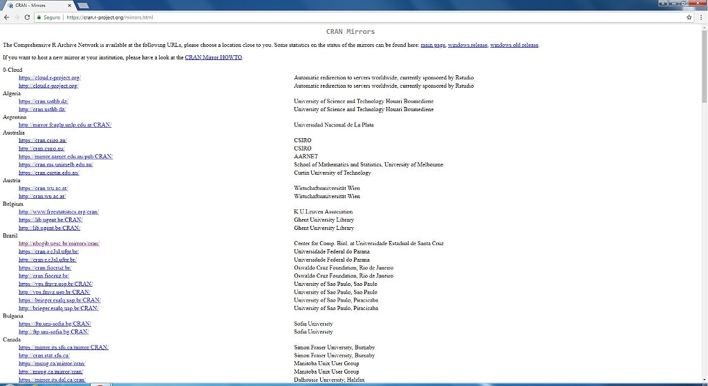
***
Escolha seu sistema operacional 
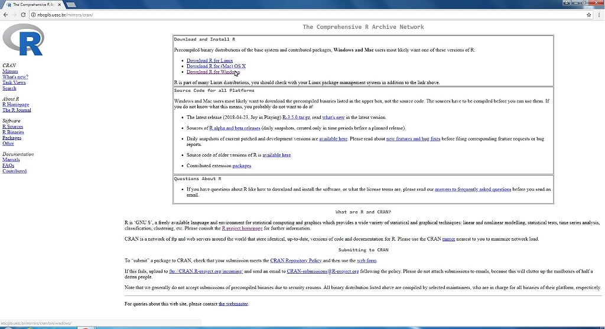
***
Clique em _*install R for the first time.*_

***
Clique em Download

***
Execute o Arquivo

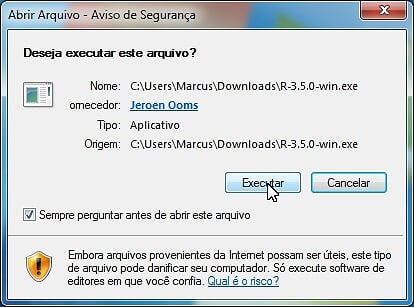

***
Prossiga com a Instalação

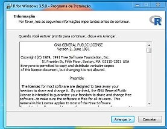 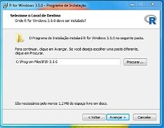 
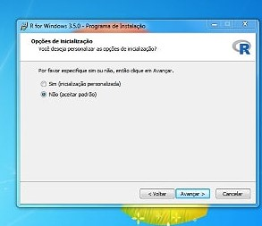 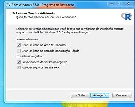 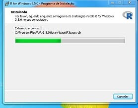 
***
Fim da instalação

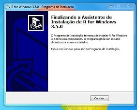


--- &vertical

## Instalando o RStudio
 Para baixar e instalar o RStudio, vá em https://www.rstudio.com e **clique em Download RStudio**
 
 
***

Clique em **Download**
 

***
Escolha a Versão do seu sistema operacional 
 

***
Execute o Arquivo e Prossiga com a instalação 
 
***
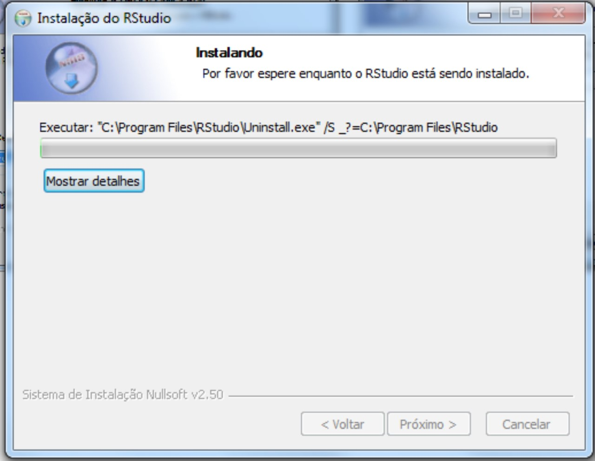
***
 
***

### Instalação Finalizada e Tudo Pronto para Iniciar o RStudio

--- &vertical

## Interface do RStudio 

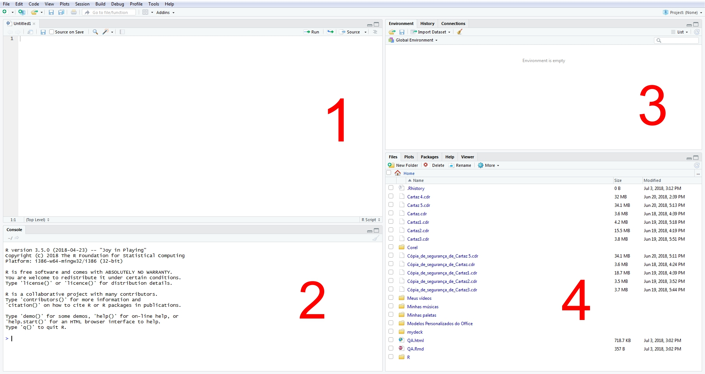

***
## Editor de Código

<small> No editor de código, você poderá escrever e editar os scripts. Script nada mais é do que um conjunto de comandos que serão executados em sequência. O editor do RStudio oferece facilidades como indentação, code complete, destaque da sintaxe, etc.</small>

***
## Console

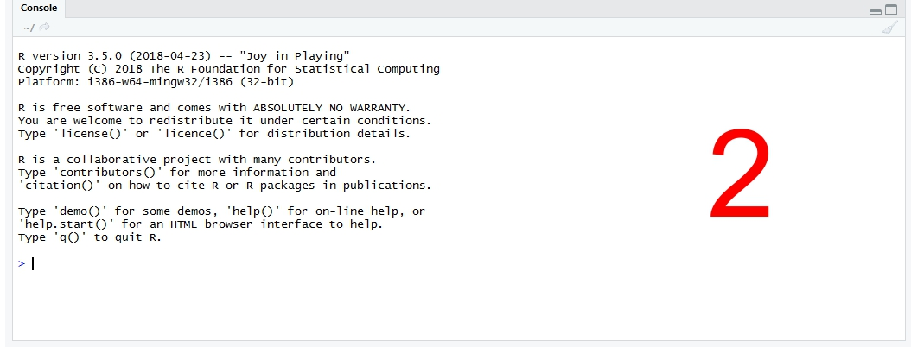

<small> No console aparecerão os resultados dos comandos. Você também pode escrever no console e obter os resultados, sem uso do editor de código. Também pode-se chamar a ajuda diretamente pelo console. Por exemplo: ?lm. </small>

***
## Environment e History
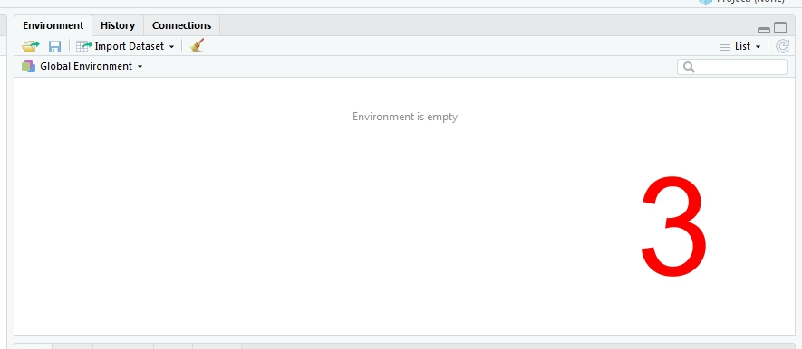
<small> No Environment ficarão guardados todos os objetos que forem criados na sessão. Entenda sessão como o espaço de tempo entre o momento em que você inicia o R e o momento que finaliza. Nesse período tudo que você faz usa memória RAM e o processador do computador. E na aba History, como você deve imaginar, o RStudio cria um histórico de comandos.</small>

***
#### Files, Plots, Packages, Help e Viewer.

<small> Nessa janela, estão várias funcionalidades do RStudio. Na aba Files, você terá uma navegação de arquivos do seu computador. Também será possível definir o diretório de trabalho (você também pode definir diretamente no código, mas isto será tratado posteriormente), ou seja, o R entende o seu diretório de trabalho como ponto de partida para localizar arquivos que sejam chamados no script.</small>
***
## Plots
A aba Plots trará os gráficos gerados, possibilitando a exportação para alguns formatos diferentes, como png e pdf.

## Packages
Em Packages, estão listados os pacotes que estão instalados e você pode verificar quais estão carregados e, caso necessário, poderá carregar algum pacote necessário para a sua análise. Também é possível instalar e atualizar pacotes. Novamente, tudo isso é possível fazer diretamente no código.
***
## Help
Help o nome já diz tudo. Essa aba será bastante utilizada por você. Saber usar o help é fundamental para evitar desperdício de tempo. 

## Viewer
Por fim, o Viewer. Essa funcionalidade é utilizada para visualizar localmente conteúdo web. O gráfico da figura está na aba Viewer porque é uma visualização em javascript, que pode ser adicionada a documentos htmls gerados usando o RMarkdown ou em aplicações web com suporte do Shiny.

--- &vertical

## Pacotes 
 No R, existe uma grande diversidade de pacotes. Estes pacotes contêm um conjunto
de funções que permitem ou facilitam a realização das análises estatísticas, além de
possuírem ajuda para suas funções e demonstrações de execução.
Ao instalar o R, apenas alguns pacotes vêm juntos, os quais são essenciais para o
funcionamento do programa, os quais denominamos de módulo ou pacote básico, além
de muitos poderem servir de base e pré-requisito para o funcionamento de outros
pacotes. 

***

## Instalando um Pacote

```
install.packages("Nome do Pacote", dependencies = T)
```

***

### Carregando um Pacote

Para utilizar as funções de um pacote, você deve carregá-lo antes. Para isso, você deve usar o seguinte comando:

```
library(Nome do Pacote) ou require(Nome do Pacote)
```

--- &vertical

## Usando o console


<small> Sendo bem simplista, R é uma linguagem que funciona com base em comandos. O console é o lugar onde você digita um comando (uma instrução) e em seguida recebe uma resposta com o resultado. Para quem nunca teve contato com nenhuma outra linguagem de programação, esse simples conceito pode parecer um pouco abstrato. Não há como entendê-lo sem ser praticando.

Observe no console do RStudio que há um símbolo >. Esse símbolo indica o lugar onde você vai escrever os seus comandos.</small>

***

## Algumas Operações Matemáticas


```r
2+2
```

```
## [1] 4
```


```r
4-2
```


```
## [1] 2
```


```r
25*9
```

```
## [1] 225
```

```r
55/6
```

```
## [1] 9.166667
```

```r
2^2
```

```
## [1] 4
```

```r
((4+16)/4)^2
```

```
## [1] 25
```
***
## Variáveis
<small> uso de variáveis é extremamente útil, pois muito provavelmente você precisará armazenar resultados de comandos para operá-los em conjunto logo em seguida.

Para armazenar uma variável no R, você deve usar o seguinte símbolo **<- ou =** formando uma setinha direcionada para a esquerda. Você pode chamar suas variáveis do que você quiser! Elas podem conter letras, números, ponto ., e underscore _, e podem ter o tamanho qualquer tamanho. Há apenas uma regra: o nome das variáveis deve começar com letras (maiúsculas ou minúsculas)</small>


```r
   minha_PRIMEIRA.variavel <- 9 ^ 10 #Nome da variável apenas para exemplificar!
```
***

## Funções de criação de vetores 


```r
#Criar um vetor simples com os elementos informados em c()
v1 <- c("A","B","C","D","E","F")
#Verifica o conteudo do v1
v1
```

```
## [1] "A" "B" "C" "D" "E" "F"
```

```r
#verifica o segundo item do vetor v1
v1[2]
```

```
## [1] "B"
```

```r
#Cria um vetor com a sequencia numérica de 1 a 50
v2 <- c(1:50)
v2
```

```
##  [1]  1  2  3  4  5  6  7  8  9 10 11 12 13 14 15 16 17 18 19 20 21 22 23
## [24] 24 25 26 27 28 29 30 31 32 33 34 35 36 37 38 39 40 41 42 43 44 45 46
## [47] 47 48 49 50
```

***

## Funções 

Uma função tem dois elementos básicos: o nome e o(s) parâmetro(s). Por exemplo, função para cálculo de raiz quadrada:

```r
sqrt(9) # Tira a raiz quadrada dos argumentos entre parênteses, no caso 9
```

```
## [1] 3
```

```r
sqrt(3*3^2) # raiz quadrada de 27
```

```
## [1] 5.196152
```

```r
sqrt((3*3)^2)# raiz quadrada de 81
```

```
## [1] 9
```

```r
log(3) # log natural de 3
```

```
## [1] 1.098612
```
***

```r
log(3,10)# log de 3 na base 10
```

```
## [1] 0.4771213
```

```r
log10(3)# o mesmo que acima! log 3 na base 10
```

```
## [1] 0.4771213
```

```r
# Abs é a função para pegar os valores em módulo
abs(3-9) # abs = modulo, |3-9|
```

```
## [1] 6
```

```r
# Para fazer o fatorial de algum número use factorial()
 factorial(4) #4 fatorial (4!)
```

```
## [1] 24
```
*** 
##  Tipos de Dados
  
  <small> Basicamente temos quatro tipos de dados no R: númericos, caracteres, lógicos e números complexos. Cada objeto possui dois atributos: tipo (mode) e o tamanho (length) </small>
  
#### Numérico
  
  
  ```r
  valor <- 605
  valor
  ```
  
  ```
  ## [1] 605
  ```
#### Caracteres

```r
D <- "Olá, mundo!"
D
```

```
## [1] "Olá, mundo!"
```
#### Lógicos

```r
2 < 6
```

```
## [1] TRUE
```
#### Números complexos

```r
nc=2 + 3i
nc
```

```
## [1] 2+3i
```

***
  
  ```r
  mode(valor)
  ```
  
  ```
  ## [1] "numeric"
  ```
  
  ```r
  length(valor)
  ```
  
  ```
  ## [1] 1
  ```
  
  ```r
  mode(D)
  ```
  
  ```
  ## [1] "character"
  ```
  
  ```r
  mode(2<4)
  ```
  
  ```
  ## [1] "logical"
  ```
  
  ```r
  mode(nc)
  ```
  
  ```
  ## [1] "complex"
  ```
***
## Comandos Auxiliares
  
  
  Função         |   Descrição
-----------------|-----------------
ls() ou objects()| lista curta de variáveis definidas
ls.str()         |lista detalhada de variáveis definidas
str(x)           |  ver informações detalhadas de x
ls.str(ab)       | ver informações detalhadas sobre todas as variáveis com "ab" em seu nome
rm(x)            | deletar variável x
rm(x, y)         |  deletar as variáveis x e y
rm(list = ls())  |  deletar todas as variáveis (limpar a workspace)
class(x)         | ver que tipo de objeto é x
ctrl + L         | no teclado, pressione "ctrl+L" para limpar a tela da console


--- &vertical

### Carregando Dados do Excel

```
setwd("C:/Users/Marcus/Desktop/mydec") # Definir Diretótio 
```

```r
read.csv("Dados1.csv",sep = ";", dec = ",",h=T) # Comando para Ler dados do Excel
```

```
##                                    Alimentos Total
## 1                                      Arroz 160.3
## 2                             Arroz integral   8.1
## 3                Preparações à base de arroz   2.4
## 4                        Milho e preparações  20.4
## 5                                     Feijão 182.9
## 6                         Feijão verde/corda   6.3
## 7               Preparações à base de feijão   8.4
## 8                         Outras leguminosas   1.3
## 9                                     Alface   3.6
## 10                                     Couve   3.8
## 11                                   Repolho   1.0
## 12                               Salada crua  14.8
## 13                           Outras verduras   1.4
## 14                                   Abóbora   2.3
## 15                                   Cenoura   0.9
## 16                                    Chuchu   0.8
## 17                                    Pepino   0.6
## 18                                    Tomate   6.5
## 19                           Outros  legumes   4.6
## 20                               Batata-doce   2.5
## 21                            Batata-inglesa  14.7
## 22                      Batata-inglesa frita   0.5
## 23                                  Mandioca   6.1
## 24                         Outros tubérculos   1.2
## 25                                   Abacaxi   1.4
## 26                                      Açaí   3.0
## 27                                    Banana  18.6
## 28                                   Laranja  20.6
## 29                                      Maçã  11.6
## 30                                     Mamão   6.4
## 31                                     Manga   4.7
## 32                                  Melancia   4.2
## 33                                 Tangerina   4.5
## 34                                       Uva   1.2
## 35                          Salada de frutas   2.2
## 36                             Outras frutas   7.7
## 37                               Oleaginosas   0.4
## 38                       Farinha de mandioca   7.1
## 39                                    Farofa   1.9
## 40                          Cereais matinais   0.8
## 41                                    Massas   4.9
## 42                      Macarrão instantâneo   5.3
## 43 Macarrão e preparações à base de macarrão  36.3
## 44                                Pão de sal  53.0
## 45                              Pão integral   0.9
## 46                                     Bolos  13.9
## 47                             Biscoito doce   4.0
## 48                          Biscoito salgado   6.8
## 49                         Biscoito recheado   4.6
## 50        Pães, bolos e biscoitos diet/light   0.3
## 51                              Carne bovina  63.2
## 52        Preparações à base de carne bovina   3.0
## 53                               Carne suína   8.5
## 54                                      Aves  36.5
## 55                Preparações à base de aves   0.9
## 56              Peixes frescos e preparações  23.4
## 57                        Peixes em conserva   0.4
## 58                           Peixes salgados   2.9
## 59                           Outros pescados   0.7
```
***
```
dados <- read.csv("caminho_e_nome_do_arquivo.csv",opções)
```
Opções:
<small>
- **sep: caractere utilizado para separação dos campos e valores.Normalmente é utilizado o ponto e vírgula (;)**

- **dec: caractere utilizado para separar as casas decimais. Normalmente ponto (.) ou vírgula (,).**

- **header: TRUE, assume que a primeira linha da tabela contém rótulos das variáveis.FALSE, assume que os dados se iniciam na primeira linha.**

</small> 
```
install.packages("xlsx", dependencies = T) # Pacote Usado para Ler dados do Excel
```
***

### Especificar uma linha ou Coluna dos dados do Excel


```r
tab=read.csv("Dados1.csv",sep = ";", dec = ",",h=T)

tab$Alimentos # Mostar a Coluna Alimentos 
```

```
##  [1] Arroz                                    
##  [2] Arroz integral                           
##  [3] Preparações à base de arroz              
##  [4] Milho e preparações                      
##  [5] Feijão                                   
##  [6] Feijão verde/corda                       
##  [7] Preparações à base de feijão             
##  [8] Outras leguminosas                       
##  [9] Alface                                   
## [10] Couve                                    
## [11] Repolho                                  
## [12] Salada crua                              
## [13] Outras verduras                          
## [14] Abóbora                                  
## [15] Cenoura                                  
## [16] Chuchu                                   
## [17] Pepino                                   
## [18] Tomate                                   
## [19] Outros  legumes                          
## [20] Batata-doce                              
## [21] Batata-inglesa                           
## [22] Batata-inglesa frita                     
## [23] Mandioca                                 
## [24] Outros tubérculos                        
## [25] Abacaxi                                  
## [26] Açaí                                     
## [27] Banana                                   
## [28] Laranja                                  
## [29] Maçã                                     
## [30] Mamão                                    
## [31] Manga                                    
## [32] Melancia                                 
## [33] Tangerina                                
## [34] Uva                                      
## [35] Salada de frutas                         
## [36] Outras frutas                            
## [37] Oleaginosas                              
## [38] Farinha de mandioca                      
## [39] Farofa                                   
## [40] Cereais matinais                         
## [41] Massas                                   
## [42] Macarrão instantâneo                     
## [43] Macarrão e preparações à base de macarrão
## [44] Pão de sal                               
## [45] Pão integral                             
## [46] Bolos                                    
## [47] Biscoito doce                            
## [48] Biscoito salgado                         
## [49] Biscoito recheado                        
## [50] Pães, bolos e biscoitos diet/light       
## [51] Carne bovina                             
## [52] Preparações à base de carne bovina       
## [53] Carne suína                              
## [54] Aves                                     
## [55] Preparações à base de aves               
## [56] Peixes frescos e preparações             
## [57] Peixes em conserva                       
## [58] Peixes salgados                          
## [59] Outros pescados                          
## 59 Levels: Abacaxi Abóbora Açaí Alface Arroz Arroz integral ... Uva
```

```r
attach(tab) # uma maneira mais facil de linha ou Coluna dos dados do Excel
names(tab) # mostrar os nomes das variáveis
```

```
## [1] "Alimentos" "Total"
```

***


```r
Alimentos #  Mostar a Coluna Alimentos 
```

```
##  [1] Arroz                                    
##  [2] Arroz integral                           
##  [3] Preparações à base de arroz              
##  [4] Milho e preparações                      
##  [5] Feijão                                   
##  [6] Feijão verde/corda                       
##  [7] Preparações à base de feijão             
##  [8] Outras leguminosas                       
##  [9] Alface                                   
## [10] Couve                                    
## [11] Repolho                                  
## [12] Salada crua                              
## [13] Outras verduras                          
## [14] Abóbora                                  
## [15] Cenoura                                  
## [16] Chuchu                                   
## [17] Pepino                                   
## [18] Tomate                                   
## [19] Outros  legumes                          
## [20] Batata-doce                              
## [21] Batata-inglesa                           
## [22] Batata-inglesa frita                     
## [23] Mandioca                                 
## [24] Outros tubérculos                        
## [25] Abacaxi                                  
## [26] Açaí                                     
## [27] Banana                                   
## [28] Laranja                                  
## [29] Maçã                                     
## [30] Mamão                                    
## [31] Manga                                    
## [32] Melancia                                 
## [33] Tangerina                                
## [34] Uva                                      
## [35] Salada de frutas                         
## [36] Outras frutas                            
## [37] Oleaginosas                              
## [38] Farinha de mandioca                      
## [39] Farofa                                   
## [40] Cereais matinais                         
## [41] Massas                                   
## [42] Macarrão instantâneo                     
## [43] Macarrão e preparações à base de macarrão
## [44] Pão de sal                               
## [45] Pão integral                             
## [46] Bolos                                    
## [47] Biscoito doce                            
## [48] Biscoito salgado                         
## [49] Biscoito recheado                        
## [50] Pães, bolos e biscoitos diet/light       
## [51] Carne bovina                             
## [52] Preparações à base de carne bovina       
## [53] Carne suína                              
## [54] Aves                                     
## [55] Preparações à base de aves               
## [56] Peixes frescos e preparações             
## [57] Peixes em conserva                       
## [58] Peixes salgados                          
## [59] Outros pescados                          
## 59 Levels: Abacaxi Abóbora Açaí Alface Arroz Arroz integral ... Uva
```

```r
Alimentos[39] #  Mostar a linha 39 da coluna Alimentos
```

```
## [1] Farofa
## 59 Levels: Abacaxi Abóbora Açaí Alface Arroz Arroz integral ... Uva
```

***

```
tab[linha,coluna]
```


```r
tab[39,] #  Mostar a linha 39 da Tabela
```

```
##    Alimentos Total
## 39    Farofa   1.9
```

```r
detach(tab) #  Sair do modo Attach
```


--- &vertical

## Estatística 

### Funções estatísticas do R

Função                   |Significado
-------------------------|-------------------------
max(x)	                 |Valor máximo de x.
min(x)                   |Valor mínimo de x.
sum(x)                   |Soma dos valores de x.
mean(x)	                 |Retorna a média de x.
median(x)                |Retorna a mediana de x.
range(x)                 |Retorna a amplitude de x.
sd(x)	                   |Retorna o desvio-padrão de x.
var(x)                   |Retorna a variância de x.
summary(x)               |Retorna a um resumo estatistico de x. 
quantile(x,probs = n)    |Retorna os quantis de interesse
***
### Exemplo com dados fictícios 


```r
x=c(24,23,22,28,35,21,23,33,34,24,21,25,36,26,22,30,32,25,26,33,34,21,31,25,31,26,25,35,33,31)
```


```r
max(x) #Valor máximo de x.
```

```
## [1] 36
```

```r
min(x)#Valor mínimo de x.
```

```
## [1] 21
```

```r
sum(x)#Soma dos valores de x.
```

```
## [1] 835
```

```r
mean(x)#Retorna a média de x.
```

```
## [1] 27.83333
```

```r
median(x)#Retorna a mediana de x.
```

```
## [1] 26
```
***


```r
range(x)#amplitude de x.
```

```
## [1] 21 36
```

```r
sd(x)# desvio-padrão de x.
```

```
## [1] 4.927637
```

```r
var(x)# variância de x.
```

```
## [1] 24.28161
```

```r
length(x) # quantidade de observações do vetor x.
```

```
## [1] 30
```

```r
H=diff(range(x)) # Diferença entre minino e maximo
H
```

```
## [1] 15
```
***

```r
summary(x) # resumo estatistico
```

```
##    Min. 1st Qu.  Median    Mean 3rd Qu.    Max. 
##   21.00   24.00   26.00   27.83   32.75   36.00
```

```r
quantile(x,probs = c(0.25,0.50,0.75)) 
```

```
##   25%   50%   75% 
## 24.00 26.00 32.75
```
***

## Definição do número de classes (k)

<small> É importante que a distribuição conte com um número adequado de
classes. Se esse número for escasso, os dados originais ficarão tão comprimidos que pouca informação poderá
ser extraida desta tabela. Se, por outro lado, forem utilizadas muitas classes, haverá algumas com frequência
nula ou muito pequena, apresentando uma distribuição irregular e prejudicial a interpretação do fenômeno.
Para determinar o número de classes há diversos métodos. Milone (2004, p.36) apresenta os seguintes critérios
para a determinação do número de intervalos, denotado por k:</small>

<small> 

- **Raiz quadrada: k =√n;**
- **Regra de Sturges: k = 1 + 3, 3 log n;**
- **Regra de Milone: k = log 1 + 2 × ln n;**

</small>


```r
k=round(sqrt(length(x)),digits=0)
k
```

```
## [1] 5
```

***

## Amplitude do Intervalo de Classe (h) 
<small> A amplitude de um intervalo de classe corresponde ao comprimento
desta classe. Numericamente, sua amplitude pode ser definida como a diferença existente entre os limites
superior (ou inferior) de duas classes consecutivas (h = ls ??? li) </small> 


```r
h=H/k  #Amplitude do Intervalo de Classe (h)
h
```

```
## [1] 3
```
***
## Limites de Classe  
<small>Os limites de classe são seus valores extremos. 
lsn: Limite superior da na classe; lsn = lin + h.</small>


```r
brk<-seq(21,36,3);brk
```

```
## [1] 21 24 27 30 33 36
```

```r
classes<-c("21|-24","24|-27","27|-30","30|-33","33|-|36") # nomes das classes
classes
```

```
## [1] "21|-24"  "24|-27"  "27|-30"  "30|-33"  "33|-|36"
```

***


```r
# cut(variável, faixas, rótulos, opções) #Divisão de dados Divide os dados em faixas determinadas.
table(cut(x,breaks=brk,right=F,labels=classes)) # Tabela de freq. com Intervalos de Classes
```

```
## 
##  21|-24  24|-27  27|-30  30|-33 33|-|36 
##       7       9       1       5       7
```

```r
#right: TRUE faz com que o intervalo seja fechado na direita e aberto na esquerda FALSE faz com que o intervalo seja aberto na direita e fechado na esquerda
Pm <- (brk[-1]+brk[-6])*0.5 #AX armazenará os pontos médios dos intervalos
table(cut(x,breaks=brk,  include.lowest = T, right = F, dig.lab = 36,labels=classes)) # Tabela de freq. com Intervalos de Classes
```

```
## 
##  21|-24  24|-27  27|-30  30|-33 33|-|36 
##       7       9       1       5       8
```

***

```r
Freq=c( 7,9,1,5,8 )
data.frame(Idade=classes, Pm=(brk[-1]+brk[-6])*(0.5), Frequência=Freq)
```

```
##     Idade   Pm Frequência
## 1  21|-24 22.5          7
## 2  24|-27 25.5          9
## 3  27|-30 28.5          1
## 4  30|-33 31.5          5
## 5 33|-|36 34.5          8
```

```r
Freq.Perc=round(Freq/30*100,digits=2)
data.frame(Idade=classes, Pm=(brk[-1]+brk[-6])*(0.5), Frequência=Freq,Freq.Perc=Freq.Perc )
```

```
##     Idade   Pm Frequência Freq.Perc
## 1  21|-24 22.5          7     23.33
## 2  24|-27 25.5          9     30.00
## 3  27|-30 28.5          1      3.33
## 4  30|-33 31.5          5     16.67
## 5 33|-|36 34.5          8     26.67
```
***

```r
Fac = cumsum(Freq)
data.frame(Idade=classes, Pm=(brk[-1]+brk[-6])*(0.5), Frequência=Freq,Freq.Perc=Freq.Perc, Freq.Acum=Fac)
```

```
##     Idade   Pm Frequência Freq.Perc Freq.Acum
## 1  21|-24 22.5          7     23.33         7
## 2  24|-27 25.5          9     30.00        16
## 3  27|-30 28.5          1      3.33        17
## 4  30|-33 31.5          5     16.67        22
## 5 33|-|36 34.5          8     26.67        30
```


--- &vertical


#### Agora Criando tabela de frequência com um pacote

<small> Tabela de Distribuição de Frequências, Histogramas e Polígonos (Frequency Distribution Tables, Histograms and Poligons - fdth) é um pacote para o R.</small> 


```r
install.packages("fdth", dependencies = T)
```

```
## Installing package into 'C:/Users/marcu/Documents/R/win-library/3.5'
## (as 'lib' is unspecified)
```

```
## Error in contrib.url(repos, "source"): trying to use CRAN without setting a mirror
```

#### Chamando o pacote


```r
library (fdth)
```

```
## 
## Attaching package: 'fdth'
```

```
## The following objects are masked from 'package:stats':
## 
##     sd, var
```

***


### Usando o Pacote

<small> Obter Ajuda sobre o pacote
*help(fdth)*

"fdt"(x, k, start, end, h, breaks=c('Sturges', 'Scott', 'FD'), right=FALSE, ...) </small>


  Função         |   Descrição
-----------------|-----------------
*x*      |Um vector, data.frame etc
*k*      | Número de intervalos de Classes.
*start*  | começo do primeiro intervalo de classes
*end*    | final direito do último intervalo de classe.
*h*      |Amplitude do intervalo de classe.
*breaks* | Método usado para determinar o número de classes de intervalo, c ("Sturges", "Scott", "FD").
*right*  |Pontos de extremidade direitos abertos (padrão = FALSE).

***
## Criando a tabela

```r
(fdt <- fdt(x))
```

```
##  Class limits f   rf rf(%) cf  cf(%)
##       [21,23) 7 0.23 23.33  7  23.33
##       [23,26) 6 0.20 20.00 13  43.33
##       [26,29) 4 0.13 13.33 17  56.67
##       [29,31) 4 0.13 13.33 21  70.00
##       [31,34) 4 0.13 13.33 25  83.33
##       [34,36) 5 0.17 16.67 30 100.00
```

*** 


```r
(fdtscoot <- fdt(x,breaks='Scott'))
```

```
##  Class limits  f   rf rf(%) cf  cf(%)
##       [21,26) 13 0.43 43.33 13  43.33
##       [26,31)  8 0.27 26.67 21  70.00
##       [31,36)  9 0.30 30.00 30 100.00
```


```r
(fdFD <- fdt(x, k=8))
```

```
##  Class limits f   rf rf(%) cf  cf(%)
##       [21,23) 5 0.17 16.67  5  16.67
##       [23,25) 4 0.13 13.33  9  30.00
##       [25,27) 7 0.23 23.33 16  53.33
##       [27,29) 1 0.03  3.33 17  56.67
##       [29,31) 1 0.03  3.33 18  60.00
##       [31,32) 4 0.13 13.33 22  73.33
##       [32,34) 5 0.17 16.67 27  90.00
##       [34,36) 3 0.10 10.00 30 100.00
```

--- &vertical

### Gráficos 
##### Gráfico de barras

```
barplot(height, opções...)
```

Opções:

<small>Função</small>      |   <small>Descrição</small>
---------------------------|---------------------------
<small> height</small>     |<small> Vetor ou matriz que irá descrever as barras do gráfico</small>
<small> width</small>      |<small> Vetor com a largura das colunas (barras).</small>
<small> space</small>      |<small> Espaçamento entre as barras</small>
<small> names.arg</small>  |<small> Vetor com os rótulos</small>
<small> beside</small>     |<small> Valor lógico. Se “FALSE”, as barras serão empilhadas. Se “TRUE”, as barras são colocadas lado a lado</small>
<small>horiz</small>      |<small> Valor lógico. Se “FALSE”, as barras são serão dispostas verticalmente. Se “TRUE”, as barras são dispostas horizontalmente.</small>
<small> col</small>        |<small> Vector de cores das barras</small>
<small> main,sub</small>   |<small> Título e caption do gráfico, respectivamente</small>

***


```r
prof<-c(1751,1186,947,29)
escola<-c("privada","estadual","municipal","federal")
barplot(prof, names.arg=escola, main="Distribuição de professores do ensino fundamental em Niterói, 2009", ,ylab="matrículas",ylim = c(0,2000),xlab="escolas",col = rainbow(4),sub="fonte:www.ibge.com.br")
```


***

```r
carros <- table(mtcars$gear)
barplot(carros, main="Distribuição de carros", horiz=TRUE,
  names.arg=c("3 Anos", "4 Anos", "5 Anos"), col = rainbow(3))
```


***
### Gráfico de Pizza

```r
g<-  c(21, 62, 10,53)
Rotulos <-  c("London","New York","Singapore","Mumbai")
porcentagem<- round(100*g/sum(x), 1)
pie(g, labels = porcentagem, main = "Gráfico de Pizza",col = rainbow(5))
legend("bottomright", c("London","New York","Singapore","Mumbai"), cex = 0.8,fill = rainbow(5))
```

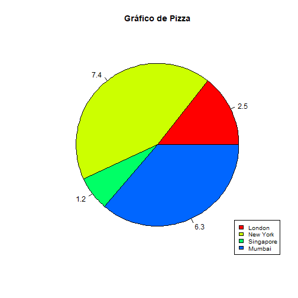
***
Histograma

```r
## Gera numeros aleatorios com distribuicao normal, mas determinando a media e desvio padrao desejado
z=rnorm(500,mean=10,sd=1);
hist(x)
```


***
### Histograma com pacote fdth

```r
require(fdth)
plot(fdt)
```


***
### Boxplot


```r
boxplot(z, main="Dados Aleatórios")
```


---

## Referência Bibliográfica
````
https://cran.r-project.org/web/packages/fdth/fdth.pdf
https://www.statmethods.net/graphs/pie.html
https://www.tutorialspoint.com/r/r_pie_charts.htm
https://www.rdocumentation.org/packages/graphics/version/3.5.0/topics/pie
http://www.dme.ufrj.br/~henriqueneto/materiais/barplot.pf
https://www.statmethods.net/graphs/bar.html
http://www.ufpa.br/heliton/arquivos/programacao/R/R_graficos.pdf
http://bgconsultoria.com.br/blog/uma-breve-introducao-ao-software-r/
http://www.abgconsultoria.com.br/blog/uma-breve-introducao-ao-software-r/
https://edisciplinas.usp.br/pluginfile.php/2996937/mod_resource/content/1/Tutorial.pdf
```
